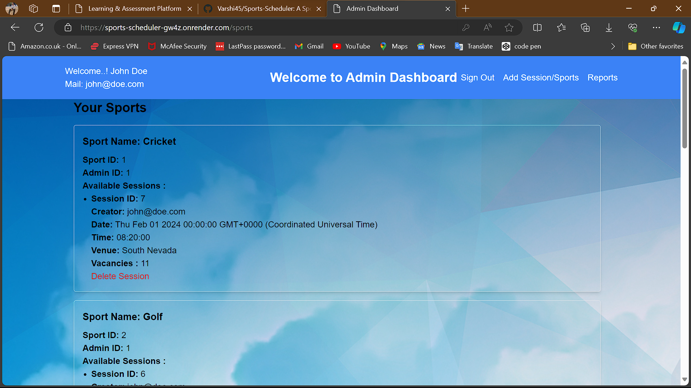

# Sports Management System

This is a Sports Management System built using Node.js, Express.js, Sequelize ORM, Passport.js for authentication, and EJS for rendering views. The system allows administrators to manage sports and sessions, and players to join sessions.

## Features

- **Authentication**: Users can sign up as administrators or players, and log in securely using email and password.
- **Authorization**: Different routes are protected based on user roles. Administrators have access to admin dashboard to manage sports and sessions, while players have access to player dashboard to view and join sessions.
- **CRUD Operations**: Administrators can create, read, update, and delete sports and sessions.
- **Session Management**: Players can view available sessions and join them. The system ensures team size constraints are met when joining sessions.
- **CSRF Protection**: Cross-Site Request Forgery protection is implemented using csurf middleware.
- **Password Hashing**: User passwords are securely hashed using bcrypt.

## Installation

1. Clone the repository:

   ```bash
   git clone https://github.com/your/repository.git
   ```

2. Install dependencies:

   ```bash
   npm install
   ```

3. Set up environment variables:
   - Create a `.env` file based on `.env.example`.
   - Provide values for environment variables.

4. Set up your database:
   - Configure your database connection in `config/database.js`.
   - Run migrations to create database schema:

     ```bash
     npx sequelize-cli db:migrate
     ```

5. Run the application:

   ```bash
   npm start
   ```

## Usage

Once the application is running, you can access it through a web browser or use API endpoints with tools like Postman.

## Endpoints

### Authentication

- `POST /signup`: Register a new administrator or player.
- `POST /login`: Log in with email and password.
- `GET /signout`: Log out the user.

### Admin Operations

- `POST /create-admin`: Create a new administrator.
- `POST /create-sport`: Create a new sport.
- `GET /sports/:adminId`: Get all sports associated with an admin.
- `GET /sessions/:sportId`: Get all sessions for a specific sport.
- `POST /create-session`: Create a new session.
- `DELETE /delete-session/:sessionId`: Delete a session.

### Player Operations

- `POST /create-player`: Create a new player.
- `GET /player`: View player dashboard with available sessions and joined sessions.
- `POST /join`: Join a session.

### Other Operations

- `GET /sessions/:sportId/:sessionId`: Get details of a specific session.
- `GET /players/:id`: Get details of a specific player.


### Screenshots

### Admin Dashboard


